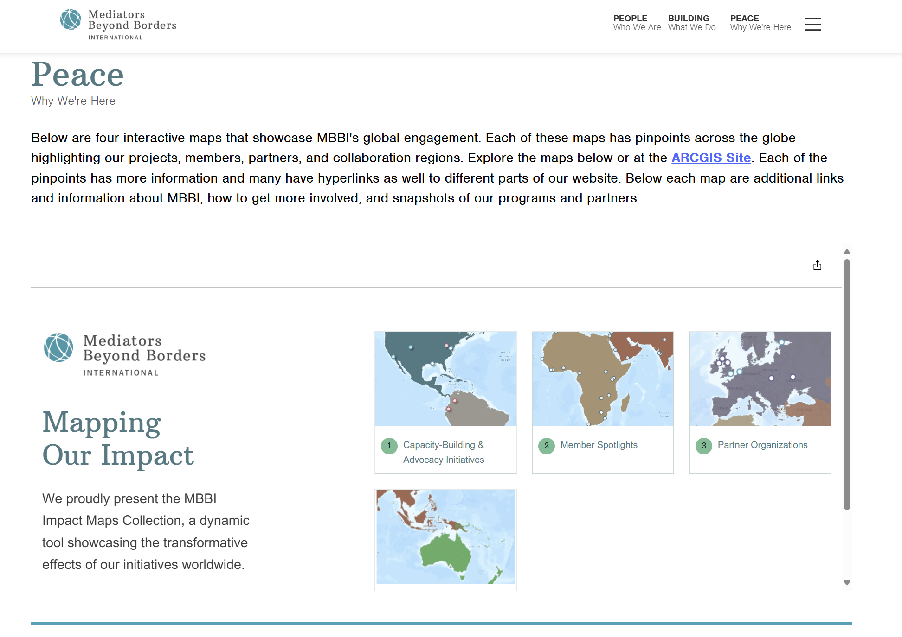

 # Mediator Beyond Borders International Web Mapping
This project, completed through the Data Science for Sustainable Development (DSSD) Club at The George Washington University, focuses on creating an interactive ArcGIS Pro web map collection for Mediators Beyond Borders International (MBBI). The goal was to visualize the organization’s global peacebuilding initiatives, member presence, and partnership networks to identify engagement gaps and strengthen regional collaboration. 

## Project Structure
- `ArcGIS Pro Web Map Collection` - Visualizes global initiatives, partners, and members.
- `Data Sources` - Organizational and geographic datasets compiled and cleaned from internal and public records.
- `Deliverable` - Final interactive web map hosted on MBBI’s official website.

## Key Insights
- Integrated and cleaned organizational and geospatial data to ensure accurate global representation.
- Designed interactive layers highlighting program reach, partnerships, and underrepresented regions.
- Collaborated with MBBI leadership to refine the visualization and align the map with the organization’s outreach goals.
  
## Tools & Technologies
 - **ArcGIS Pro** 
- **Python**
- **Excel** 

## Deliverable
- [View the Interactive Map on MBBI Website](https://mediatorsbeyondborders.org/why-we-are-here/)

